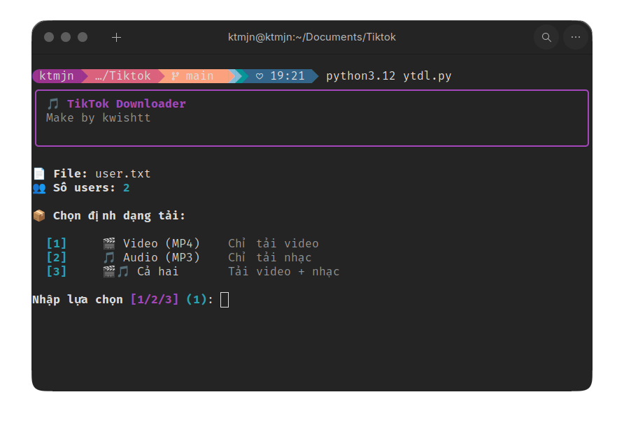

<div align="center">

# TikTok Downloader

**Công cụ CLI đơn giản và mạnh mẽ để tải hàng loạt video và audio từ TikTok.**

[](https://python.org)
[](LICENSE)
[](https://github.com/yt-dlp/yt-dlp)

[English](../README.md) | [Tiếng Việt](#tinh-nang)

</div>

---

## Tính năng

<table>
<tr>
<td></td>
<td>Tải từ nhiều profile TikTok cùng lúc</td>
</tr>
<tr>
<td></td>
<td>Tải video chất lượng cao nhất</td>
</tr>
<tr>
<td></td>
<td>Chỉ tải âm thanh</td>
</tr>
<tr>
<td></td>
<td>File được sắp xếp theo folder <code>@username</code></td>
</tr>
<tr>
<td></td>
<td>Bỏ qua user đã check gần đây (không có video mới)</td>
</tr>
<tr>
<td></td>
<td>Tích hợp delay và cơ chế retry</td>
</tr>
<tr>
<td></td>
<td>Thanh tiến trình đẹp với thời gian ước tính</td>
</tr>
<tr>
<td></td>
<td>Dùng cookie trình duyệt để tránh bị giới hạn</td>
</tr>
</table>

---

## Yêu cầu

- Python 3.8+
- [yt-dlp](https://github.com/yt-dlp/yt-dlp)
- [ffmpeg](https://ffmpeg.org/) (để trích xuất audio)
- Trình duyệt Chrome/Edge (để lấy cookies)

---

## Cài đặt

### 1. Clone repository
```bash
git clone https://github.com/kwishtt/tikdl.git
cd tikdl
```

### 2. Cài đặt dependencies
```bash
pip install -r requirements.txt
```

### 3. Cài đặt yt-dlp và ffmpeg
```bash
# yt-dlp
pip install yt-dlp

# ffmpeg (Ubuntu/Debian)
sudo apt install ffmpeg

# ffmpeg (macOS)
brew install ffmpeg

# ffmpeg (Windows)
# Tải từ https://ffmpeg.org/download.html
```

---

## Screenshot

<div align="center">

</div>

---

## Cách sử dụng

### 1. Tạo file danh sách user
Tạo file `user.txt` với các URL profile TikTok (mỗi dòng 1 URL):
```
https://www.tiktok.com/@username1
https://www.tiktok.com/@username2
https://www.tiktok.com/@username3
```

### 2. Chạy tool
```bash
python3 ytdl.py
```

### 3. Chọn định dạng
```
Chọn định dạng tải:

  [1]  Video (MP4)    Chỉ tải video
  [2]  Audio (MP3)    Chỉ tải nhạc
  [3]  Cả hai         Tải video + nhạc

Nhập lựa chọn [1/2/3] (1): 
```

### 4. Xác nhận và tải
Tool sẽ:
1. Scan tất cả users
2. Hiển thị bảng tổng quan
3. Tải với progress bar
4. Lưu file vào `TikTok_Downloads/@username/`

---

## Cấu trúc thư mục

```
TikTok_Downloads/
├── @username1/
│   ├── video_title_abc123.mp4
│   ├── video_title_def456.mp4
│   └── .video_archive          # (ẩn) theo dõi video đã tải
├── @username2/
│   └── ...
└── .download_cache.json        # (ẩn) cache smart skip
```

---

## Cấu hình

Chỉnh sửa các biến trong `ytdl.py`:

```python
# Cài đặt chống block
MIN_DELAY = 3          # Delay tối thiểu giữa users (giây)
MAX_DELAY = 8          # Delay tối đa giữa users (giây)

# Smart skip
SKIP_HOURS = 24        # Bỏ qua nếu đã check trong X giờ
```

---

## Tính năng chống Block

| Tính năng | Mô tả |
|-----------|-------|
| Random delay | Delay ngẫu nhiên 3-8s giữa các user |
| Sleep requests | Delay 1.5s giữa các HTTP request |
| Sleep interval | Delay ngẫu nhiên 2-5s giữa các video |
| Retry mechanism | Tự động thử lại khi lỗi (tối đa 5 lần) |
| Exponential backoff | Tăng thời gian chờ khi bị rate limit (429) |
| Browser cookies | Dùng cookie Chrome để xác thực |

---

## Smart Skip

Tool ghi nhớ thời điểm check mỗi user. Nếu:
- User đã check trong vòng 24 giờ, VÀ
- Lần trước không có video mới

User sẽ được **bỏ qua** để tiết kiệm thời gian.

Để buộc tải lại tất cả, xóa file cache:
```bash
rm TikTok_Downloads/.download_cache.json
```

---

## Xử lý lỗi

### Lỗi "Rate limited"
- Đổi sang mạng di động (3G/4G)
- Chờ 10-30 phút
- Dùng VPN

### Video không tải được
- Cập nhật yt-dlp: `pip install -U yt-dlp`
- Kiểm tra profile có private không
- Thử với cookie trình duyệt khác

### Không tìm thấy ffmpeg
```bash
# Ubuntu/Debian
sudo apt install ffmpeg

# Kiểm tra cài đặt
ffmpeg -version
```

---

## Giấy phép

MIT License - thoải mái sử dụng và chỉnh sửa!

---

## Đóng góp

Pull requests được hoan nghênh! Với thay đổi lớn, vui lòng mở issue trước.

---

<div align="center">

**Nếu thấy hữu ích, hãy cho repo một star!**

[](https://github.com/kwishtt/tikdl)

Made with love by [kwishtt](https://github.com/kwishtt)

</div>
